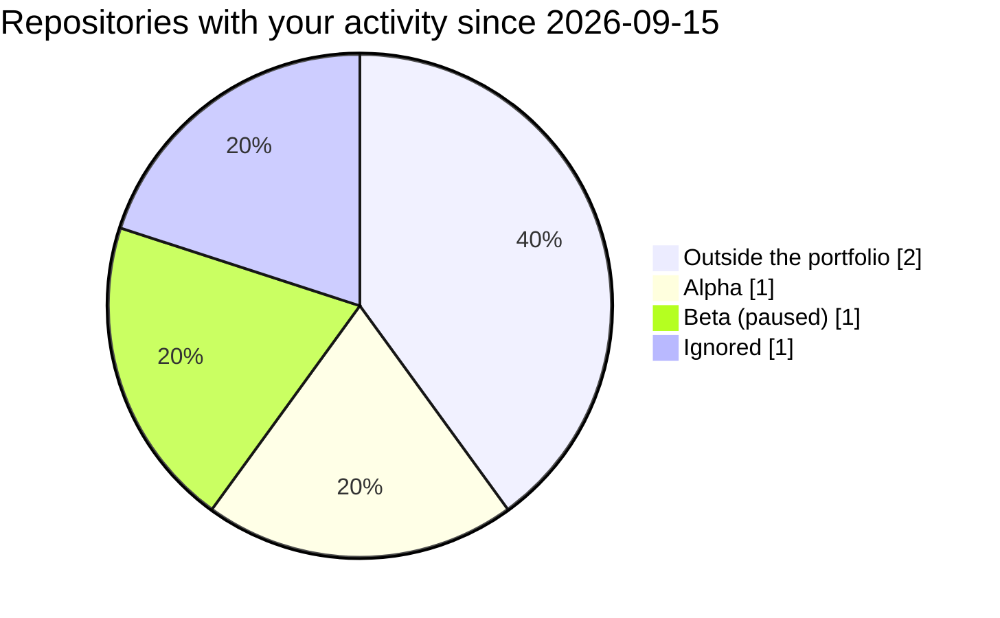

<!-- Generated by portfolio-ops. The workflow rewrites this page from the data files, so edit those instead. -->

# Portfolio overview

**Overview** · [Products](products.md) · [Repositories](repositories.md) · [Risks](risks.md) · [Decisions](decisions.md)

Generated by portfolio-ops for 2026-09-22 (UTC). These pages show the state of the data files and decide nothing: the rules run in validate, the weekly report and the gates.

## At a glance

| Measure | Now |
|---|---|
| [Active products](products.md#active) | 2 of 4 (wip_limit) |
| Focus this week | **none recorded** |
| Stale products | 1 (stale_days: 30) |
| [Ideas](products.md#ideas) | 1 |
| [Paused or dormant](products.md#paused-and-dormant) | 2, 1 review overdue |
| [Archived](products.md#archived) | 1 |
| [Kernels](products.md#kernels) | 1: 0 done, 1 extracted, 0 planned |
| [Open risks](risks.md#risks) | 3, 2 high or critical |
| [Findings](risks.md#findings) | 2, 1 expired |
| [Copy-paste debt](risks.md#copy-paste-debt) | 1 |
| [Repositories worked on](repositories.md) | 5 since 2026-09-15, 2 outside the portfolio |
| Data last committed | 2026-09-20 |

## Needs attention

- **Stale:** Alpha (`alpha`), 52 days — the clock is past stale_days (30). See [the active products](products.md#active).
- **Reviews overdue:** Beta (`beta`), due 2026-09-01. See [paused and dormant](products.md#paused-and-dormant).
- **Acceptances ended:** Two offline edits can overwrite each other (`core-data-loss`), accepted until 2026-09-01 — they count as open again. See [the risks](risks.md#risks).
- **Open high or critical risks:** The first sync after an update can crash the app (`alpha-crash`), critical. See [the risks](risks.md#risks).
- **Expired findings:** Syncs a change in under a second on a phone (`alpha-sync-claim`), held until 2026-09-01 — check each again before it is used. See [the findings](risks.md#findings).
- **Copy-paste debt:** Epsilon (`epsilon`) carries a copy of Core (`core`). See [the copy-paste debt](risks.md#copy-paste-debt).
- **Work outside the portfolio:** 2 repositories you worked on since 2026-09-15 belong to no product or kernel. See [the week's repositories](repositories.md#worked-on-this-week).
- **Products that are not active, worked on:** Beta (`beta`), paused, in [`example-owner/beta`](https://github.com/example-owner/beta).
- **Listed repositories the account does not have:** `example-owner/gamma-renamed`, listed by Gamma (`gamma`). See [the repositories](repositories.md#listed-but-not-found).
- **No focus recorded this week.** Record one in decisions.md as `## 2026-09-22 · <product> · focus`.

## This week

**No focus recorded this week.**

| Product | Next action | Clock | Last push |
|---|---|---|---|
| Alpha (`alpha`) | Write the first draft of the sync protocol | 52 days since 2026-08-01, **stale** | 2026-09-21 |
| Epsilon (`epsilon`) | Measure how long a sync takes on a slow network | 8 days since 2026-09-14 | — |

## Where the work went

Your activity since 2026-09-15 is in 5 of the 10 repositories scanned. The chart groups them by the product or kernel that lists them, and [the repositories page](repositories.md#worked-on-this-week) names them.

## Latest decisions

- 2026-09-08 · focus · Alpha (`alpha`)
- 2026-08-10 · risk\_accepted · Two offline edits can overwrite each other (`core-data-loss`)
- 2026-08-03 · status\_change · Beta (`beta`)
- 2026-07-01 · status\_change · Omega (`omega`)

Every decision, with its text: [Decisions](decisions.md).
