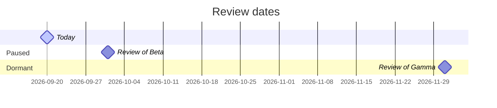

<!-- Generated by portfolio-ops. The workflow rewrites this page from the data files, so edit those instead. -->

# Products

[Overview](README.md) · **Products** · [Repositories](repositories.md) · [Risks](risks.md) · [Decisions](decisions.md)

Generated by portfolio-ops for 2026-09-20 (UTC). These pages show the state of the data files and decide nothing: the rules run in validate, the weekly report and the gates.

## Active

1 of at most 4 (wip_limit).

| Product | Next action | Clock | Capabilities | Kernels | Repositories |
|---|---|---|---|---|---|
| Alpha (`alpha`), **focus** | Write the first draft of the sync protocol | 5 days since 2026-09-15 | sync | Core (`core`), package | — |

## Ideas

1 idea, not yet through the idea gate.

| Idea | Capabilities | Latest decision |
|---|---|---|
| Delta (`delta`) | maps | — |

## Paused and dormant

| Product | Status | Reason | Review by | Next action |
|---|---|---|---|---|
| Beta (`beta`) | paused | Waiting until alpha ships | 2026-10-01, in 11 days | — |
| Gamma (`gamma`) | dormant | Released and stable | 2026-12-01, in 72 days | — |

## Archived

| Product | Latest decision |
|---|---|
| Omega (`omega`) | 2026-07-01 · status\_change |

## Kernels

| Kernel | State | Capabilities | As a package | As a copy | Planned | Repositories |
|---|---|---|---|---|---|---|
| Core (`core`) | extracted, 1 of 2 package consumers | sync | Alpha (`alpha`) | — | — | [`example-owner/core`](https://github.com/example-owner/core) |
